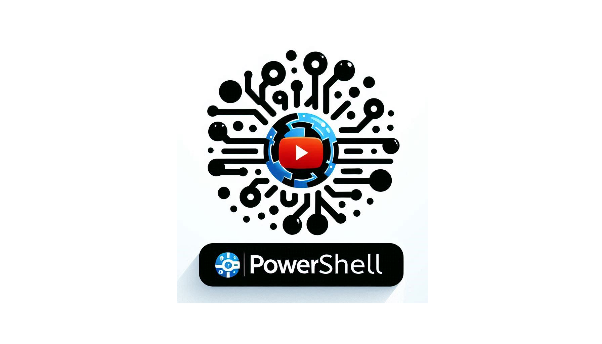

# PSYT



## PowerShell Module for Retrieving YouTube Transcripts

### Using the Module

```powershell
import-module .\PSYT.psm1
```

### Example

Reqirements:

- [PSAI Module](https://github.com/dfinke/psai)
- [OpenAI API Key](https://help.openai.com/en/articles/4936850-where-do-i-find-my-openai-api-key)

```powershell
# Source: https://youtu.be/OHQFObW6PXA
get-transcript -videoId OHQFObW6PXA | ai "Summarize this video transcript"
```

Output:

```text
The video discusses creating an application without coding using artificial intelligence. It explains setting up a Python environment and installing necessary components like Azure Identity and Open AI. The plan is to interact with an Open AI GPT model using Python code. The process involves obtaining tokens, environment variables for authentication, and then interacting with the model by sending prompts and receiving responses. The video emphasizes the importance of not storing secrets within the code and suggests using environment variables or Azure Key Vault for sensitive information. The demonstration concludes with running the Python script to query the AI model about the highest mountain in the world and displaying the response in JSON format. The code snippet focuses on user roles, context interactions, and establishing permissions for running the AI application securely. Additionally, it explains the need to set up environment variables properly while interacting with external APIs or services to ensure secure and efficient operation.
```

---

### TODO

- [ ] Add more examples
- [x] Fix encode issue
- [ ] Add getting video description
- [ ] Add getting video title
- [ ] Add getting video chapters
